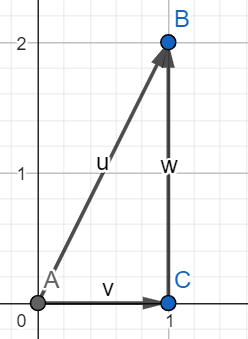

#physics 

A vector can have a direction, so...

For the vector $u$ above, the perpendicular component of the vector is $v$ and $w$, where $v + w = u$ ([see vector addition](Vector%20addition))

In this case, the horizontal component is of magnitude 1, and the vertical component is of magnitude 2

It is possible to calculate the angle at which vector $u$ using [trigonometry](Trignometry.md)

